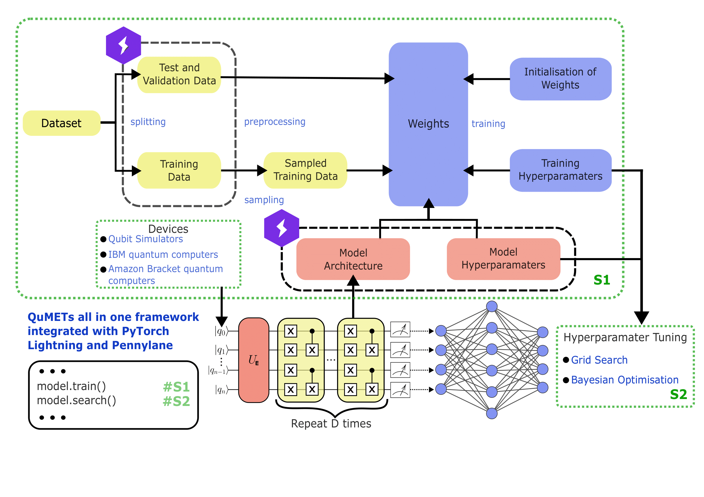

# QuMET

QuMET is a quantum machine learning (QML) library designed to empower researchers and developers to explore the intersection of quantum computing and machine learning. Leveraging the capabilities of quantum processors, QuMET provides a set of tools and algorithms for quantum-enhanced machine learning tasks with a specific focus on quantum generative modelling. Built on top of [Pennylane](https://github.com/PennyLaneAI/pennylane/tree/master) and [PyTorch](https://github.com/pytorch/pytorch).

---

## Key Features

The main QuMET module contains tools for quantum circuit construction and standalone/hybrid quantum machine learning algorithms. This includes:

- Quantum circuits: QuMET allows users to design and simulate quantum circuits, providing a foundation for implementing quantum algorithms and utilizing quantum data encoding techniques to represent classical data in a quantum format suitable for computations.
- Quantum Algorithm Implementation: QuMET includes implementations of key quantum machine learning algorithms, such as quantum generative adversarial networks, quantum variational autoencoders and more.
- Hybrid Classical-Quantum Models: Combine classical and quantum components to build hybrid models for machine learning tasks.

## Research Memory Boundary

QuMET is treated as the PhD testing-platform/software-quality stream. Keep this repository focused on platform documentation: installation, usage, tests, packaging, configuration, examples, and JOSS-facing reproducibility.

Long-form PhD research memory belongs in Obsidian instead:

- PhD stream note: `Research/PhD/QuMET.md`
- Use that note for theory, experiment interpretation, algorithm-review notes, and cross-stream synthesis.

See `docs/research-memory-boundary.md` for the repository/Obsidian split.

This repo contains the following directories:
* `src/qumet` - QuMET's software stack
* `scripts` - Installation scripts  
* `docs` - Documentation

Currently SEARCH functionality is still in progress.

